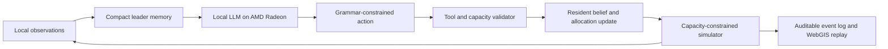

# QuakeSense Project Specification

## 1. Application scenario

Earthquake evacuation is a coupled behavior-and-capacity problem. Information affects when residents depart and which shelter they choose, but it cannot create road throughput or shelter capacity. QuakeSense is a privacy-preserving scenario laboratory for testing how locally deployed AI leaders change that coupled process.

The system is designed for researchers and emergency-planning analysts who need inspectable counterfactual experiments rather than an opaque forecast. It does not issue operational instructions and is not an official emergency-management system.

## 2. Agent architecture



Jurisdiction leaders receive only local state: residents still moving, residents sheltered, congestion, reachable shelters, and remaining capacity. A compact memory stores recent decisions. The local model ranks only shelters offered by the validator; a formal grammar prevents arbitrary identifiers from becoming actions. Validated actions update resident destination allocation, and the simulator advances the physical state.

## 3. Core capabilities

### 3.1 Population-conserving evacuation dynamics

For each block and time step, population is partitioned into waiting, in-transit, sheltered, and stopped states:

\[
N_b = W_b(t) + T_b(t) + S_b(t) + G_b(t).
\]

Every transition is bounded by the available source population. Tests enforce non-negativity and conservation after each step.

### 3.2 Departure timing

Departure follows a configurable log-normal response distribution:

\[
F(t)=\Phi\left(\frac{\ln t-\mu}{\sigma}\right).
\]

This separates behavioral delay from physical movement and makes assumptions explicit.

### 3.3 Physical egress capacity

Boundary flow for effective width \(w\), pedestrian specific flow \(q\), and time step \(\Delta t\) is:

\[
C_{edge}=wq\Delta t.
\]

Actual departures are the minimum of desired departures, waiting population, and edge capacity.

### 3.4 Shelter admission and rerouting

Admission is capped by remaining shelter capacity. Leaders may redistribute demand among reachable shelters, but the validator rejects unavailable destinations and the simulator never admits more residents than capacity permits.

### 3.5 Auditable multi-city evidence

The submission includes common-format animated replays for Los Angeles, Naples, Wellington, L'Aquila, Noto, Kumamoto, and Kathmandu. Each replay exposes the time path of transit, shelter arrivals, and unresolved population. The evidence is synthetic and is not presented as observed individual movement.

## 4. Local model and deployment plan

The agent layer supports a local llama.cpp-style HTTP endpoint. The model runs on the participant-controlled Radeon host; prompts contain bounded local state and no personal identifiers. The decoder grammar permits only offered shelter IDs or the explicit hold action. Tool validation, timeouts, and deterministic fallbacks keep the physical simulator independent of free-form text.

Deployment sequence:

1. Install the ROCm-compatible model runtime and Python dependencies.
2. Start the local model server with continuous batching.
3. Load or build city-agnostic block, route, and shelter inputs.
4. Run the simulator with the local leader endpoint.
5. Validate conservation and capacity invariants.
6. Export compact replay payloads for browser review.

Model weights, credentials, private city inputs, and unpublished run arrays remain outside Git.

## 5. AMD Radeon and ROCm optimization

The leader workload consists of many short, structured requests. QuakeSense uses concurrent requests and continuous batching so the Radeon device processes multiple leader decisions together. Compact prompts reduce memory traffic, while grammar-constrained decoding shortens responses and removes invalid-output retries. Simulation arrays remain device-oriented where practical, and CPU/GPU transfers are minimized between decision rounds.

The demonstration includes measured local runtime, throughput, validity, concurrency, memory, and utilization evidence from AMD Radeon through ROCm. Baseline simulator throughput and language-model inference measurements are reported separately; one is not used as a proxy for the other.

## 6. Source and reproducibility

The `source/` directory contains the complete public-safe agent, simulator, routing, capacity, geospatial, and test implementation. `source/README.md` documents environment setup and execution. Private raw datasets are intentionally excluded; the seven archived public payloads allow reviewers to inspect the browser evidence without them.

Minimum validation:

```bash
cd source
python -m pytest tests claude/tests -q
cd ..
python tools/verify_submission.py .
```

## 7. Research meaning and limitations

The contribution is an auditable bridge between micro-level behavior, physical capacity, local information, and city-scale outcomes. It supports privacy-preserving counterfactual analysis and exposes assumptions that a single aggregate clearance time would hide.

Limitations include synthetic behavior parameters, scenario shelter capacities, incomplete representation of infrastructure failure, and dependence on source-map quality. Results are comparative research evidence, not forecasts or official evacuation plans.

## 8. AMD acknowledgment

We gratefully acknowledge AMD for providing cloud computing resources that supported large-scale data preparation, multi-city simulation, rendering, and validation. AMD Radeon and ROCm supported local inference and performance evidence. This acknowledgment does not imply AMD endorsement of the methods, scenarios, results, or conclusions.
